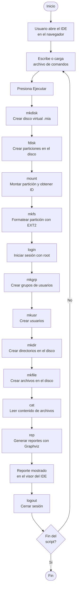

# Diagrama de Flujo - ExtreamFS
## Angel Emanuel Rodriguez Corado - 202404856

---

```mermaid
flowchart TD
    A([Inicio]) --> B[Usuario abre el IDE\nen el navegador]
    B --> C[Escribe o carga\narchivo de comandos]
    C --> D[Presiona Ejecutar]
    D --> E[mkdisk\nCrear disco virtual .mia]
    E --> F[fdisk\nCrear particiones en el disco]
    F --> G[mount\nMontar partición y obtener ID]
    G --> H[mkfs\nFormatear partición con EXT2]
    H --> I[login\nIniciar sesión con root]
    I --> J[mkgrp\nCrear grupos de usuarios]
    J --> K[mkusr\nCrear usuarios]
    K --> L[mkdir\nCrear directorios en el disco]
    L --> M[mkfile\nCrear archivos en el disco]
    M --> N[cat\nLeer contenido de archivos]
    N --> O[rep\nGenerar reportes con Graphviz]
    O --> P[Reporte mostrado\nen el visor del IDE]
    P --> Q[logout\nCerrar sesión]
    Q --> R{Fin del\nscript?}
    R -- No --> C
    R -- Si --> S([Fin])
```

---

*Diagrama de Flujo — ExtreamFS | Manejo e Implementación de Archivos | USAC 2026*