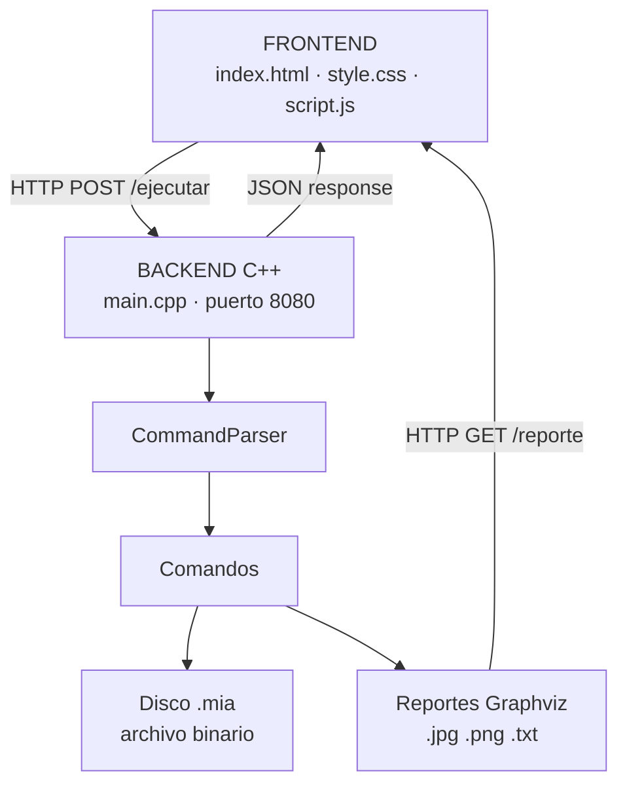
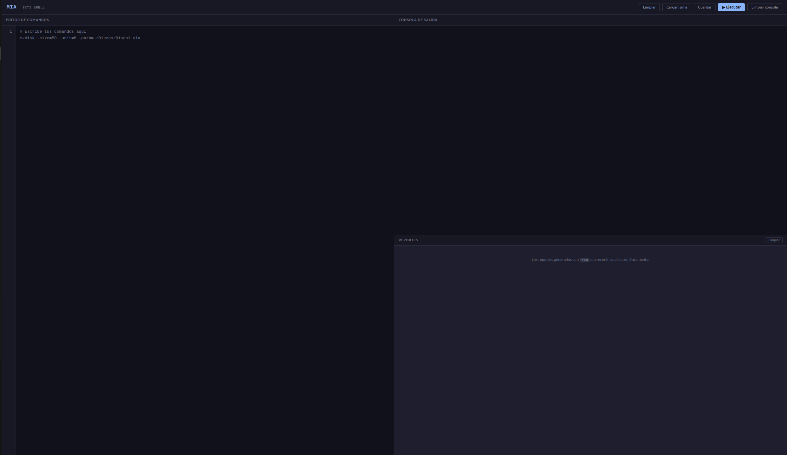

# Manual Técnico - ExtreamFS
## Angel Emanuel Rodriguez Corado - 202404856

---

## Tabla de Contenidos

1. [Descripción General](#1-descripción-general)
2. [Tecnologías Utilizadas](#2-tecnologías-utilizadas)
3. [Arquitectura del Sistema](#3-arquitectura-del-sistema)
4. [Estructura del Proyecto](#4-estructura-del-proyecto)
5. [Estructuras de Datos](#5-estructuras-de-datos)
6. [Comandos Implementados](#6-comandos-implementados)
7. [Sistema de Archivos EXT2](#7-sistema-de-archivos-ext2)
8. [Sistema de Reportes](#8-sistema-de-reportes)
9. [Servidor HTTP](#9-servidor-http)
10. [Frontend](#10-frontend)
11. [Compilación y Ejecución](#11-compilación-y-ejecución)

---

## 1. Descripción General

ExtreamFS es un simulador de sistema de archivos EXT2 implementado en C++. El sistema permite crear y administrar discos virtuales (archivos `.mia`), particionarlos, formatearlos con EXT2, y realizar operaciones de archivos y directorios. Incluye un frontend web que se comunica con el backend mediante una API REST local.

### Objetivos
- Simular el comportamiento del sistema de archivos EXT2 sobre archivos binarios
- Gestionar particiones primarias, extendidas y lógicas mediante MBR y EBR
- Implementar inodos, bloques de datos, bitmaps y superbloque
- Generar reportes visuales con Graphviz

---

## 2. Tecnologías Utilizadas

| Componente | Tecnología |
|-----------|-----------|
| Backend | C++17 |
| Servidor HTTP | cpp-httplib (single header) |
| Generación de reportes | Graphviz (dot) |
| Frontend | HTML5, CSS3, JavaScript (Vanilla) |
| Sistema operativo | Linux (Ubuntu 24) |
| Compilador | g++ 17 |

---

## 3. Arquitectura del Sistema


El usuario escribe comandos en el editor web, presiona "Ejecutar" y el JavaScript hace un `POST /ejecutar` con el texto del editor. El backend lo procesa línea por línea y devuelve la salida acumulada. Los reportes generados se sirven vía `GET /reporte?path=...` y se muestran automáticamente en el panel de reportes.
---

## 4. Estructura del Proyecto

```
Proyecto 1 Archivos/
├── backend/
│   └── src/
│       ├── main.cpp                  # Punto de entrada + servidor HTTP
│       ├── httplib.h                 # Servidor HTTP (single header)
│       ├── parser/
│       │   └── CommandParser.h       # Dispatcher de comandos
│       ├── models/
│       │   ├── structs.h             # Estructuras MBR, EBR, Inode, etc.
│       │   ├── mounted_partitions.h  # Variables globales de montaje
│       │   └── mounted_partitions.cpp
│       ├── session/
│       │   └── session.h             # Sesión activa del usuario
│       ├── commands/
│       │   ├── mkdisk.h              # Crear disco
│       │   ├── rmdisk.h              # Eliminar disco
│       │   ├── fdisk.h               # Crear particiones
│       │   ├── mount.h               # Montar particiones
│       │   ├── mounted.h             # Listar particiones montadas
│       │   ├── mkfs.h                # Formatear EXT2
│       │   ├── mkdir.h               # Crear directorio
│       │   ├── mkfile.h              # Crear archivo
│       │   ├── cat.h                 # Leer archivo
│       │   ├── mkgrp.h               # Crear grupo
│       │   ├── rmgrp.h               # Eliminar grupo
│       │   ├── mkusr.h               # Crear usuario
│       │   ├── rmusr.h               # Eliminar usuario
│       │   ├── chgrp.h               # Cambiar grupo de usuario
│       │   ├── rep.h                 # Generar reportes
│       │   └── users_utils.h         # Helpers para users.txt
│       └── users/
│           ├── Login.h               # Iniciar sesión
│           └── Logout.h              # Cerrar sesión
└── frontend/
    ├── index.html                    # Interfaz web
    ├── style.css                     # Estilos (tema oscuro)
    └── script.js                     # Lógica de comunicación
```

---

## 5. Estructuras de Datos

Todas las estructuras usan `#pragma pack(push, 1)` para evitar padding y garantizar que los tamaños sean exactos al leer/escribir en disco.

### MBR (Master Boot Record)
Se escribe al inicio del archivo `.mia` (offset 0).

```cpp
struct MBR {
    int    mbr_tamano;           // Tamaño total del disco en bytes
    time_t mbr_fecha_creacion;   // Fecha de creación (time_t)
    int    mbr_dsk_signature;    // Firma aleatoria única
    char   dsk_fit;              // Tipo de ajuste: 'B', 'F', 'W'
    Partition mbr_partitions[4]; // Máximo 4 particiones
};
```

### Partition
```cpp
struct Partition {
    char part_status;      // '0' = inactiva, '1' = activa
    char part_type;        // 'P' = primaria, 'E' = extendida, 'L' = lógica
    char part_fit;         // 'B', 'F', 'W'
    int  part_start;       // Byte donde inicia
    int  part_s;           // Tamaño en bytes
    char part_name[16];    // Nombre
    int  part_correlative; // Correlativo al montar
    char part_id[4];       // ID generado en mount
};
```

### EBR (Extended Boot Record)
Se escribe al inicio de cada partición lógica dentro de la extendida. Tamaño: **30 bytes**.

```cpp
struct EBR {
    char part_status;   // '0' = libre, '1' = ocupada
    char part_fit;      // 'B', 'F', 'W'
    int  part_start;    // Byte donde inician los datos de la lógica
    int  part_size;     // Tamaño de la partición lógica en bytes
    int  part_next;     // Byte del siguiente EBR, -1 si no hay más
    char part_name[16]; // Nombre
};
```

### Superblock
Se escribe al inicio de cada partición formateada con EXT2.

```cpp
struct Superblock {
    int    s_filesystem_type;   // 2 = EXT2
    int    s_inodes_count;      // Total de inodos (n)
    int    s_blocks_count;      // Total de bloques (3n)
    int    s_free_blocks_count; // Bloques libres
    int    s_free_inodes_count; // Inodos libres
    time_t s_mtime;             // Último montaje
    time_t s_umtime;            // Último desmontaje
    int    s_mnt_count;         // Veces montado
    int    s_magic;             // 0xEF53
    int    s_inode_size;        // sizeof(Inode) = 100 bytes
    int    s_block_size;        // sizeof(FileBlock) = 64 bytes
    int    s_first_ino;         // Primer inodo libre
    int    s_first_blo;         // Primer bloque libre
    int    s_bm_inode_start;    // Inicio bitmap de inodos
    int    s_bm_block_start;    // Inicio bitmap de bloques
    int    s_inode_start;       // Inicio tabla de inodos
    int    s_block_start;       // Inicio tabla de bloques
};
```

### Inode
Tamaño: **100 bytes**.

```cpp
struct Inode {
    int    i_uid;        // UID del propietario
    int    i_gid;        // GID del grupo
    int    i_size;       // Tamaño del archivo en bytes
    time_t i_atime;      // Último acceso
    time_t i_ctime;      // Creación
    time_t i_mtime;      // Última modificación
    int    i_block[15];  // [0..11] directos, [12] simple, [13] doble, [14] triple
    char   i_type;       // '0' = archivo, '1' = carpeta
    char   i_perm[3];    // Permisos ej: "664"
};
```

### Bloques
Todos los bloques tienen tamaño **64 bytes**.

| Estructura | Descripción | Tamaño |
|-----------|-------------|--------|
| `FolderBlock` | 4 entradas `Content` (nombre + inodo) | 64 bytes |
| `FileBlock` | 64 bytes de contenido (`char b_content[64]`) | 64 bytes |
| `PointerBlock` | 16 apuntadores enteros (`int b_pointers[16]`) | 64 bytes |
| `Content` | Nombre 12 chars + inodo int | 16 bytes |

---

## 6. Comandos Implementados

### mkdisk
Crea un disco virtual (archivo `.mia`) con un MBR inicializado.

```
mkdisk -size=<n> -unit=<B|K|M> -fit=<BF|FF|WF> -path=<ruta>
```

- `-size`: tamaño del disco
- `-unit`: unidad (B=bytes, K=kilobytes, M=megabytes, default M)
- `-fit`: tipo de ajuste para particiones (BF=best fit, FF=first fit, WF=worst fit)
- `-path`: ruta absoluta del disco, debe terminar en `.mia`

### rmdisk
Elimina un disco virtual.

```
rmdisk -path=<ruta>
```

### fdisk
Crea particiones dentro de un disco.

```
fdisk -type=<P|E|L> -unit=<B|K|M> -name=<nombre> -size=<n> -path=<ruta> -fit=<BF|FF|WF>
```

- `-type=P`: partición primaria (máximo 4 entre P y E)
- `-type=E`: partición extendida (solo una por disco)
- `-type=L`: partición lógica (dentro de la extendida, usa cadena de EBRs)

**Algoritmo de ubicación para lógicas:**
1. Localizar la partición extendida en el MBR
2. Recorrer la cadena de EBRs hasta el último (`part_next == -1`)
3. Calcular espacio libre dentro de la extendida
4. Aplicar FF/BF/WF para `sizeof(EBR) + size`
5. Escribir nuevo EBR y enlazar con el anterior

### mount
Monta una partición y le asigna un ID único.

```
mount -path=<ruta> -name=<nombre>
```

**Formato del ID:** `<2 dígitos carnet><número><letra>`  
Ejemplo: `561A` = carnet 56, primera partición del disco A.

Las particiones montadas se almacenan en un `std::map` estático en memoria.

### mounted
Lista todas las particiones actualmente montadas.

```
mounted
```

### mkfs
Formatea una partición montada con EXT2.

```
mkfs -id=<id> -type=<full|fast>
```

**Cálculo de n (número de inodos):**
```
n = (partitionSize - sizeof(Superblock)) / (4 + sizeof(Inode) + 3 * sizeof(FileBlock))
```

**Layout en disco tras mkfs:**
```
[Superblock][Bitmap Inodos (n bytes)][Bitmap Bloques (3n bytes)]
[Tabla Inodos (n * 100 bytes)][Tabla Bloques (3n * 64 bytes)]
```

**Inodos iniciales:**
- Inodo 0: directorio raíz `/`
- Inodo 1: archivo `users.txt` con contenido `1,G,root\n1,U,root,root,123\n`

### login / logout
Gestión de sesión. Solo puede haber una sesión activa a la vez.

```
login -user=<usuario> -pass=<contraseña> -id=<id_particion>
logout
```

### mkgrp / rmgrp
Gestión de grupos. Solo root puede ejecutarlos.

```
mkgrp -name=<nombre>   # Agrega línea "n,G,nombre" a users.txt
rmgrp -name=<nombre>   # Cambia el ID a 0 (eliminación lógica)
```

### mkusr / rmusr / chgrp
Gestión de usuarios. Solo root puede ejecutarlos.

```
mkusr -user=<nombre> -pass=<contraseña> -grp=<grupo>
rmusr -user=<nombre>
chgrp -user=<nombre> -grp=<nuevo_grupo>
```

**Formato de users.txt:**
```
id,G,nombre_grupo
id,U,grupo,usuario,contraseña
```

> **Nota:** Todos los comandos que modifican `users.txt` usan `users_utils.h` para leer y escribir con soporte multi-bloque (directo + indirecto simple), soportando archivos de hasta 1,792 bytes.

### mkdir
Crea un directorio en el sistema EXT2.

```
mkdir -path=<ruta> [-p]
```

- Sin `-p`: retorna error si el directorio padre no existe
- Con `-p`: crea todos los directorios intermedios necesarios

**Navegación de rutas:** se divide la ruta en segmentos, se navega inodo a inodo buscando cada segmento en los bloques de carpeta del directorio actual.

### mkfile
Crea un archivo en el sistema EXT2.

```
mkfile -path=<ruta> [-size=<n>] [-cont=<ruta_host>] [-r]
```

- `-size`: rellena el archivo con la secuencia `0123456789` repetida
- `-cont`: lee un archivo del sistema host y copia su contenido
- `-r`: crea directorios padre si no existen

**Soporte de apuntadores indirectos:**
- Bloques directos [0..11]: hasta 12 × 64 = 768 bytes
- Indirecto simple [12]: hasta 16 × 64 = 1,024 bytes adicionales
- Doble indirecto [13]: hasta 16 × 16 × 64 = 16,384 bytes adicionales

### cat
Lee y muestra el contenido de un archivo del sistema EXT2.

```
cat -file1=<ruta>
```

---

## 7. Sistema de Archivos EXT2

### Organización del disco

```
Disco1.mia
├── [0]          MBR (157 bytes)
├── [157]        Partición 1 (Part11)
│   ├── Superblock
│   ├── Bitmap de inodos    (n bytes, '0'=libre '1'=usado)
│   ├── Bitmap de bloques   (3n bytes)
│   ├── Tabla de inodos     (n × 100 bytes)
│   └── Tabla de bloques    (3n × 64 bytes)
├── [...]        Partición 2 (Part12)
└── [...]        ...
```

### Gestión del espacio libre

Los bitmaps usan caracteres `'0'` y `'1'` (no bits). Para encontrar el siguiente inodo o bloque libre, se escanea el bitmap secuencialmente buscando `'0'`.

### Inodos raíz al formatear

| Inodo | Tipo | Descripción |
|-------|------|-------------|
| 0 | Carpeta (`'1'`) | Directorio raíz `/` |
| 1 | Archivo (`'0'`) | `/users.txt` |

### Convención de `i_type`
- `'0'` = archivo
- `'1'` = carpeta (directorio)

### Convención de `i_perm`
Se almacena como `char[3]`, ejemplo: `"664"` representa `rw-rw-r--`.

---

## 8. Sistema de Reportes

Todos los reportes (excepto `bm_inode`, `bm_block` y `file`) usan Graphviz para generar imágenes. El proceso es:

1. Generar código `.dot` en memoria
2. Escribirlo en un archivo temporal `<outputPath>.dot`
3. Ejecutar `dot -T<ext> archivo.dot -o archivo.<ext>`
4. Eliminar el `.dot` temporal

### Reportes disponibles

| Nombre | Formato | Descripción |
|--------|---------|-------------|
| `mbr` | JPG/PNG | Tabla con campos del MBR y EBRs. Header morado, lógicas en rojo |
| `disk` | JPG/PNG | Vista proporcional del disco con porcentajes |
| `inode` | JPG/PNG | Un nodo por inodo usado, conectados con flechas |
| `block` | JPG/PNG | Bloques carpeta (rojo), archivo (amarillo), apuntadores |
| `bm_inode` | TXT | Bitmap de inodos, 20 bits por línea separados por espacio |
| `bm_block` | TXT | Bitmap de bloques, 20 bits por línea separados por espacio |
| `tree` | JPG/PNG | Árbol completo del filesystem desde la raíz |
| `sb` | JPG/PNG | Tabla con todos los campos del superbloque (verde) |
| `file` | TXT | Contenido del archivo especificado en `-path_file_ls` |
| `ls` | JPG/PNG | Tabla con permisos, dueño, grupo, tamaño, fecha, tipo y nombre |

### Parámetros del comando rep

```
rep -id=<id> -path=<ruta_salida> -name=<tipo> [-path_file_ls=<ruta_en_disco>]
```

- `-path_file_ls` es obligatorio para `file` y `ls`

---

## 9. Servidor HTTP

Implementado con `cpp-httplib` (single header, sin dependencias externas).

### Endpoints

#### POST /ejecutar
Recibe un bloque de comandos y devuelve la salida acumulada.

**Request:**
```json
{ "codigo": "mkdisk -size=50 -unit=M -path=~/Discos/Disco1.mia\nlogin -user=root -pass=123 -id=561A" }
```

**Response:**
```json
{ "salida": ">> mkdisk ...\nDisco creado exitosamente\n>> login ...\nLogin exitoso\n" }
```

**Procesamiento:**
1. Extraer campo `codigo` del JSON (sin dependencias externas)
2. Decodificar secuencias de escape (`\n`, `\t`, `\\`, `\"`)
3. Dividir por líneas
4. Ignorar líneas vacías
5. Comentarios (`#`) se pasan tal cual a la salida
6. Cada comando se ejecuta con `CommandParser::execute()`

#### GET /reporte?path=/ruta/imagen.jpg
Sirve archivos de imagen o texto generados por los reportes.

**Content-Type** se determina por extensión:
- `.jpg/.jpeg` → `image/jpeg`
- `.png` → `image/png`
- `.pdf` → `application/pdf`
- `.txt` → `text/plain; charset=utf-8`

### CORS
Habilitado para todos los orígenes (`*`) para permitir desarrollo local.

---

## 10. Frontend

### Archivos

| Archivo | Descripción |
|---------|-------------|
| `index.html` | Estructura de la UI: toolbar, editor, consola, visor de reportes |
| `style.css` | Tema oscuro (Catppuccin Mocha), layout fijo sin desbordamiento |
| `script.js` | Lógica: editor, fetch al backend, detección automática de reportes |

### Layout




### Detección automática de reportes

`script.js` analiza la salida del backend buscando el patrón:
```
Reporte <nombre> generado: /ruta/archivo.<ext>
```

Para cada coincidencia crea un componente en el panel de reportes:
- `.jpg/.png`: muestra la imagen cargándola desde `/reporte?path=...`
- `.txt`: hace fetch del contenido y lo muestra en un `<pre>`

---

## 11. Compilación y Ejecución

### Requisitos
```bash
sudo apt install g++ graphviz
```

### Compilar
```bash
cd "Proyecto 1 Archivos/backend/src"
g++ -std=c++17 -o main main.cpp models/mounted_partitions.cpp -lstdc++fs -lpthread
```

### Ejecutar
```bash
./main
# Servidor corriendo en http://localhost:8080
```

### Acceder al frontend
Abrir en el navegador:
```
http://localhost:8080/index.html
```

### Ejecutar script de pruebas
En el editor del frontend, cargar el archivo `.smia` con los comandos o escribirlos directamente y presionar **▶ Ejecutar**.

También se puede probar desde consola de Linux:
```bash
echo "mkdisk -size=50 -unit=M -path=~/Discos/Disco1.mia" | curl -s -X POST http://localhost:8080/ejecutar \
  -H "Content-Type: application/json" \
  -d '{"codigo":"mkdisk -size=50 -unit=M -path=~/Discos/Disco1.mia"}'
```

---

*Manual Técnico — ExtreamFS | Manejo e Implementación de Archivos | USAC 2026*